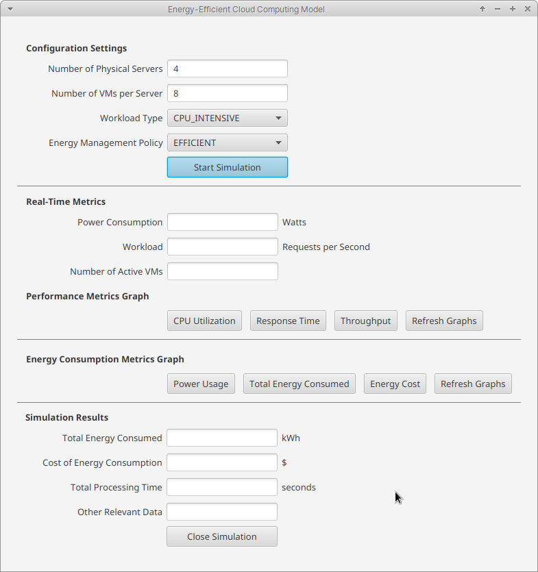

# Energy-Efficient Cloud Computing model

## Simulation results

| Cloudlet | Status  | DC   | Host | Host PEs  | VM   | VM PEs    | CloudletLen | FinishedLen | CloudletPEs | StartTime | FinishTime | ExecTime |
| -------- | ------- | ---- | ---- | --------- | ---- | --------- | ----------- | ----------- | ----------- | --------- | ---------- | -------- |
| ID       |         | ID   | ID   | CPU cores | ID   | CPU cores | MI          | MI          | CPU cores   | Seconds   | Seconds    | Seconds  |
| 0        | SUCCESS | 1    | 0    | 64        | 0    | 4         | 10000       | 10000       | 2           | 0.1       | 20.1       | 20.0     |
| 4        | SUCCESS | 1    | 0    | 64        | 4    | 4         | 10000       | 10000       | 2           | 0.1       | 20.1       | 20.0     |
| 8        | SUCCESS | 1    | 0    | 64        | 8    | 4         | 10000       | 10000       | 2           | 0.1       | 20.1       | 20.0     |
| 12       | SUCCESS | 1    | 0    | 64        | 12   | 4         | 10000       | 10000       | 2           | 0.1       | 20.1       | 20.0     |
| 1        | SUCCESS | 1    | 1    | 64        | 1    | 4         | 10000       | 10000       | 2           | 0.1       | 20.1       | 20.0     |
| 5        | SUCCESS | 1    | 1    | 64        | 5    | 4         | 10000       | 10000       | 2           | 0.1       | 20.1       | 20.0     |
| 9        | SUCCESS | 1    | 1    | 64        | 9    | 4         | 10000       | 10000       | 2           | 0.1       | 20.1       | 20.0     |
| 13       | SUCCESS | 1    | 1    | 64        | 13   | 4         | 10000       | 10000       | 2           | 0.1       | 20.1       | 20.0     |
| 2        | SUCCESS | 1    | 2    | 64        | 2    | 4         | 10000       | 10000       | 2           | 0.1       | 20.1       | 20.0     |
| 6        | SUCCESS | 1    | 2    | 64        | 6    | 4         | 10000       | 10000       | 2           | 0.1       | 20.1       | 20.0     |
| 10       | SUCCESS | 1    | 2    | 64        | 10   | 4         | 10000       | 10000       | 2           | 0.1       | 20.1       | 20.0     |
| 14       | SUCCESS | 1    | 2    | 64        | 14   | 4         | 10000       | 10000       | 2           | 0.1       | 20.1       | 20.0     |
| 3        | SUCCESS | 1    | 3    | 64        | 3    | 4         | 10000       | 10000       | 2           | 0.1       | 20.1       | 20.0     |
| 7        | SUCCESS | 1    | 3    | 64        | 7    | 4         | 10000       | 10000       | 2           | 0.1       | 20.1       | 20.0     |
| 11       | SUCCESS | 1    | 3    | 64        | 11   | 4         | 10000       | 10000       | 2           | 0.1       | 20.1       | 20.0     |
| 15       | SUCCESS | 1    | 3    | 64        | 15   | 4         | 10000       | 10000       | 2           | 0.1       | 20.1       | 20.0     |
